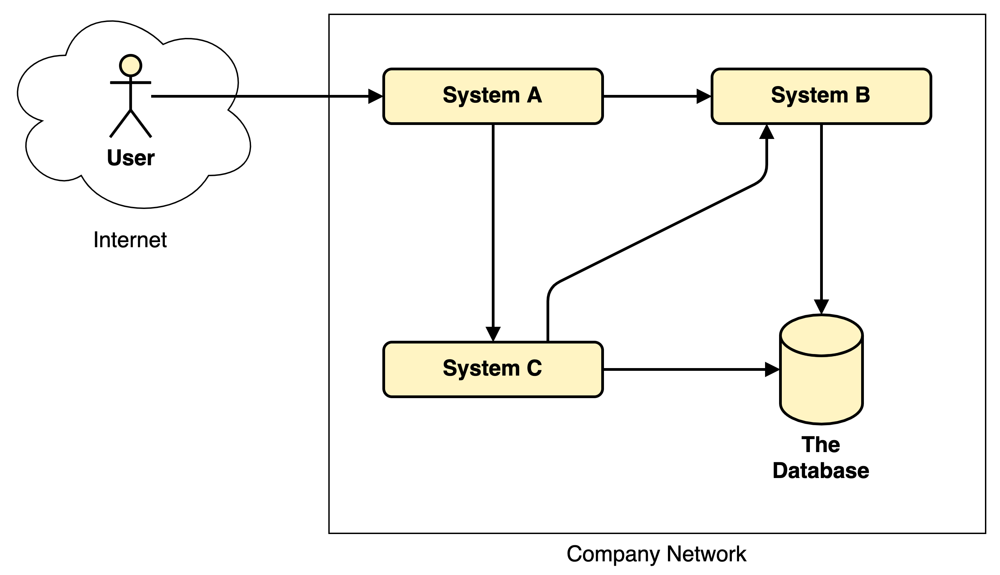

# Visual tips for system diagrams
An article describing visual tips which make it easier for the audience to understand information contained in system diagrams.

## Introduction

Before we start with the actual tips, let us first define what a system diagram is and what it is good for.

### Definition: System diagram

A **system diagram** is a visual communication tool to explain how different systems are connected to each other, and which users interact with them.
Typically, the visual language of such diagrams consists of

* stick figures,
* boxes,
* cylinders,
* clouds,
* arrows which connect shapes with each other, and
* text which are place either inside or next to the shapes.

In addition, certain types of shapes (typically the boxes) can be placed inside other shapes which allows a recursive structure.

### Example system diagram in two different visual styles

Below you see an example of a system diagram:

I don't know about you, but I think that this diagram is already quite readable, and the audience should be able to understand
* with which system the user interacts,
* which systems store something in the database,
* which system are somehow connected to which other systems,
* and what are the boundaries of the different elements.

Admittedly, this diagram is not very complicated because it contains only one user, three systems, one database, and in total six connection arrows.
With such a simple example, it should not be so important to put much emphasis on the visual style.

Well, let's see.

Let's have a look on another diagram which contains the exact same information.
But this time the creator applied a different visual style to the diagram elements.

In my point-of-view this diagram is much more difficult to read, and it is more difficult to understand what all the elements are, and how they are related to each other.
The reason for this is a suboptimal usage of colors, fonts, shapes, and sizes and arrangement of elements in relation to each other.

Maybe you think that it was me who has created this second diagram in this difficult-to-read way on purpose, just to make a point, and that I exaggerated quite a bit.
The answer is: Yes, and no.
Yes, I created the diagram intentionally like this, to make my point.
But no, I did not exaggerate :-)
If you don't believe me, please do an Internet search for the term "system diagram", and check the images your preferred search engine returns.
Some of them will be in a clean style, maybe similar to the first example diagram shown above.
But also there will be quite some images which are visually closer to the second example diagram.

Please don't misunderstand me:
**I do not want to finger-point** on others who have created such diagrams.
Most of us including me are not trained designers who had some education about the use of such visual elements.
Also, in my opinion, the visual tools out there not always provide a default configuration which would help us with creating simple designs.

## What is in for you?

If you agree with me that the second diagram shown in the previous section is somehow suboptimal, and if you also agree that the creator should and could have done better, then we are on the same page.

I believe in the following rule:

> *It is better if one person (that is, me, the creator) puts enough effort in the creation than if many persons (the audience) have to all put the effort in understanding the creation.*

To follow this rule, I have experimented a lot with visual tools which can be used to create system diagrams over the past years.
From those experiment results I distilled some general tips and tricks I now (try to) apply when I need to create such diagrams.
These tips helped me creating diagrams which I liked because of their clean structure and simplicity.

Now, if you invest your precious time in reading this text, you will find the list of all these tips.
Each tip has the goal to make it easier for the audience to understand the information the system diagram wants to convey.

I am aware that these tips will most likely not change the world, but maybe you can take-away something which supports you the next time you have to create such diagrams yourselves.

Let's get started.

---
CONTINUE HERE

---

## About text

### Choose font size inside boxes to be big enough compared to the size of the box

## First, some hand-drawn images

This section shows all the concept art I have created to prepare writing this article.
Using a hand-drawn approach helped me because a) it actually makes fun to draw something, and b) forces me to use a different skill set than just typing on a computer keyboard. 

