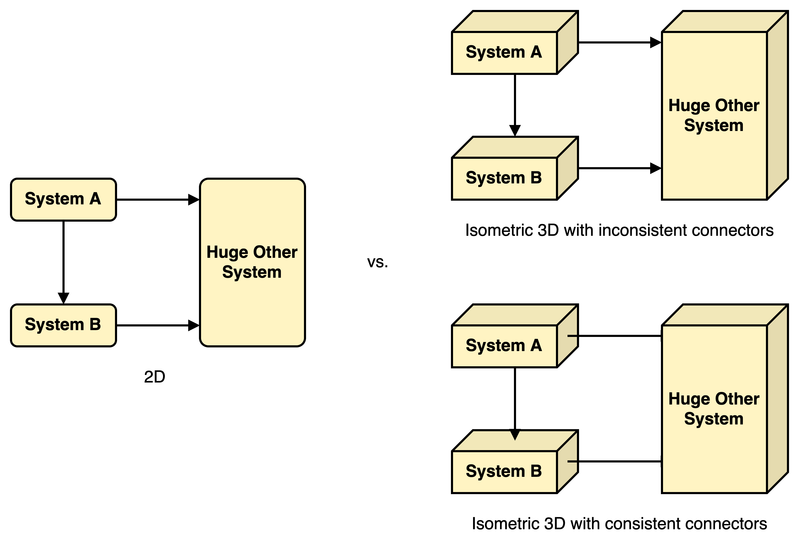
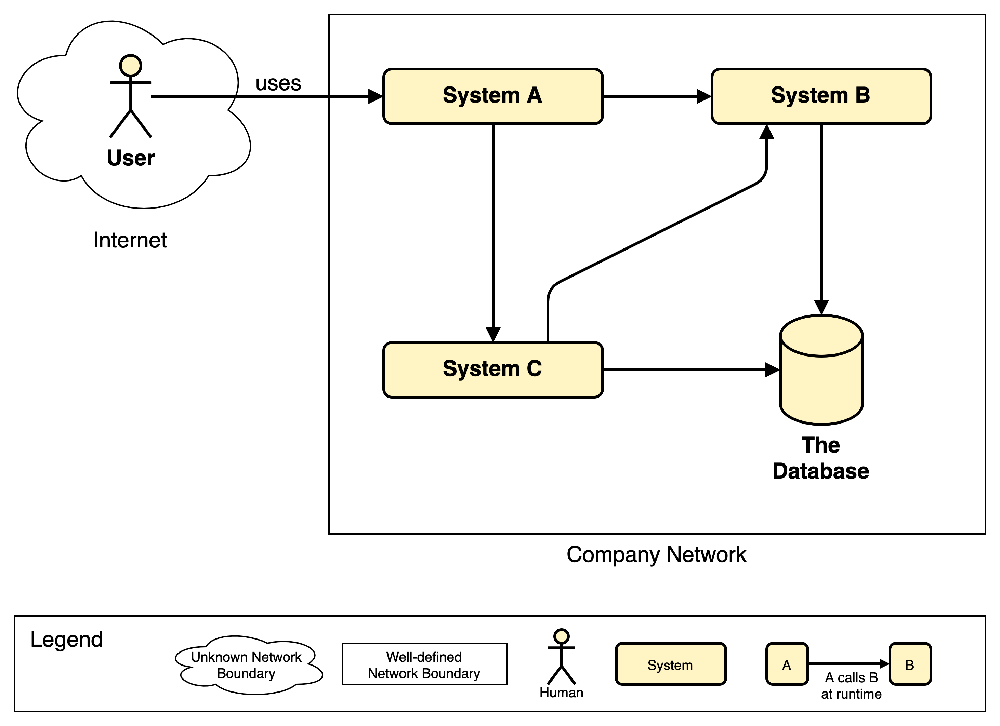
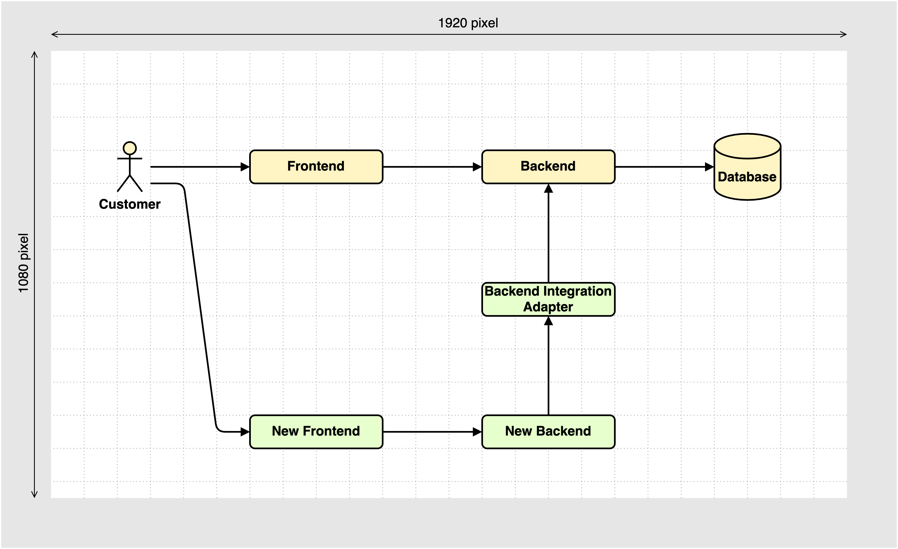
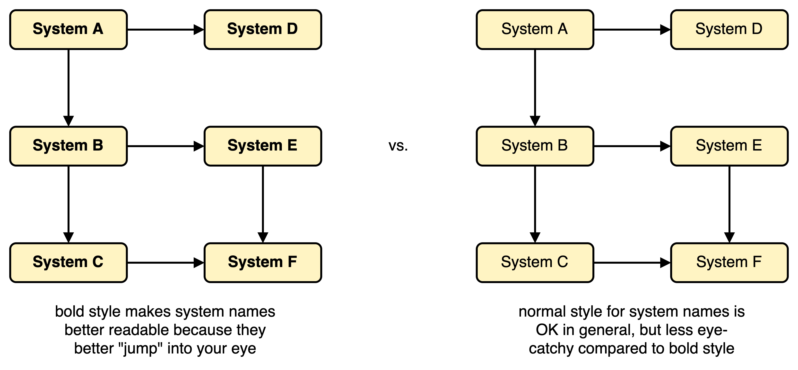
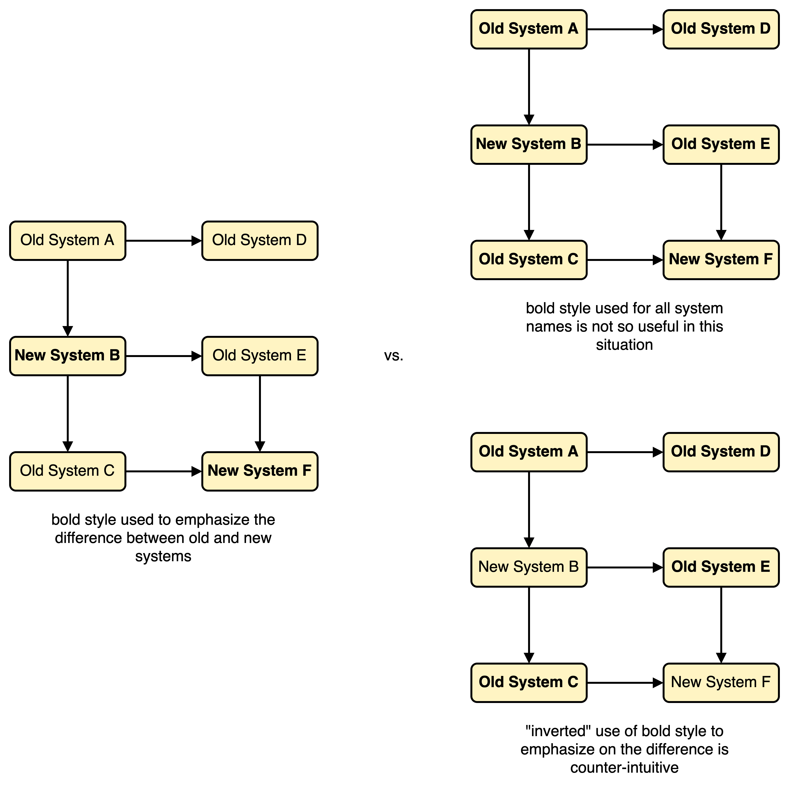

<!--
    Some meta information about this document:

    * I use the GitHub flavor of markdown.
    See [https://guides.github.com/features/mastering-markdown](https://guides.github.com/features/mastering-markdown) for how to use it.

    * I follow the one sentence per line approach which I came across several years ago when learning AsciiDoc(tor).
    See [https://asciidoctor.org/docs/asciidoc-recommended-practices/#one-sentence-per-line](https://asciidoctor.org/docs/asciidoc-recommended-practices/#one-sentence-per-line) for the reasoning behind this approach.

    * Most parts of this whole article I have written with Visual Studio Code, benefitting from its in-built Markdown support.
    To get the table of content created automically, I have added the extension "huntertran.auto-markdown-toc" and use it with its default configuration.
    So, in case you would like to change something in the structure of this article, please consider using this extension as well to keep the toc consistent with the content.
 -->

# Visual tips for system diagrams

_Martin Leggewie, 2021-07-04_

In this article I describe a collection of visual tips for creating so-called system diagrams.
The purpose of such diagrams is to convey information about a system landscape to the audience, and be the basis for discussions.
Therefore, it is a good advice to keep these diagrams as simple as possible.
If you want/need to create such diagrams yourself, then these tips can support you in reaching this "as simple as possible" goal.

----

<!-- TOC ignore:true -->
## Table of Contents

<!-- TOC -->

- [Introduction](#introduction)
    - [Definition and goal: System diagram](#definition-and-goal-system-diagram)
    - [Why should you care about how system diagrams look like?](#why-should-you-care-about-how-system-diagrams-look-like)
    - [What is in for you?](#what-is-in-for-you)
    - [Mind-map of the things to come TODO](#mind-map-of-the-things-to-come-todo)
- [General guidelines](#general-guidelines)
    - [General guideline 1: Use simple visual attributes, avoid the "bling-bling"](#general-guideline-1-use-simple-visual-attributes-avoid-the-bling-bling)
        - [Do not use color gradients](#do-not-use-color-gradients)
        - [Do not use 3D elements](#do-not-use-3d-elements)
        - [Do not use drop shadows](#do-not-use-drop-shadows)
        - [Do not use the "sketch" visual style](#do-not-use-the-sketch-visual-style)
    - [General guideline 2: Define the meaning of all visual elements in a legend](#general-guideline-2-define-the-meaning-of-all-visual-elements-in-a-legend)
    - [General guideline 3: Apply high-contrast coloring style](#general-guideline-3-apply-high-contrast-coloring-style)
    - [General guideline 4: Use stroke width to support high-contrast](#general-guideline-4-use-stroke-width-to-support-high-contrast)
- [Canvas](#canvas)
    - [Canvas guideline 1: Use infinite space](#canvas-guideline-1-use-infinite-space)
    - [Canvas guideline 2: Set-up a square-shaped grid with reasonable absolute dimensions](#canvas-guideline-2-set-up-a-square-shaped-grid-with-reasonable-absolute-dimensions)
    - [Canvas guideline 3: Enable snap to grid](#canvas-guideline-3-enable-snap-to-grid)
- [Text](#text)
    - [Text guideline 1: Use sans-serif font face](#text-guideline-1-use-sans-serif-font-face)
    - [Text guideline 2: Select font size in relation to box size](#text-guideline-2-select-font-size-in-relation-to-box-size)
    - [Text guideline 3: Use font style to guide to important parts first](#text-guideline-3-use-font-style-to-guide-to-important-parts-first)
        - [Use bold style for all important names](#use-bold-style-for-all-important-names)
        - [Use normal font style for all companion text](#use-normal-font-style-for-all-companion-text)
        - [Use italics style for meta information only](#use-italics-style-for-meta-information-only)
- [Boxes TODO](#boxes-todo)
    - [Use same size for all boxes representing the same element style TODO](#use-same-size-for-all-boxes-representing-the-same-element-style-todo)
    - [Use size for inner-most boxes to be even multiples of canvas grid size TODO](#use-size-for-inner-most-boxes-to-be-even-multiples-of-canvas-grid-size-todo)
    - [Use well-defined height-width ratio for inner-most boxes TODO](#use-well-defined-height-width-ratio-for-inner-most-boxes-todo)
    - [Watch out when using rounded corners for boxes TODO](#watch-out-when-using-rounded-corners-for-boxes-todo)
    - [Use different stroke widths when boxes are located inside other boxes TODO](#use-different-stroke-widths-when-boxes-are-located-inside-other-boxes-todo)
- [Arrows TODO](#arrows-todo)
    - [Each arrow has at least one arrow head TODO](#each-arrow-has-at-least-one-arrow-head-todo)
    - [Define exactly what the arrow directions mean TODO](#define-exactly-what-the-arrow-directions-mean-todo)
    - [Choose arrow heads to be big enough compared to diagram size TODO](#choose-arrow-heads-to-be-big-enough-compared-to-diagram-size-todo)
    - [Avoid arrow heads in both directions for call dependencies TODO](#avoid-arrow-heads-in-both-directions-for-call-dependencies-todo)
    - [Attach a bigger dot at the arrow start TODO](#attach-a-bigger-dot-at-the-arrow-start-todo)
- [Color TODO](#color-todo)
    - [Choose color so that audience's attention will be guided to the most important diagram elements first TODO](#choose-color-so-that-audiences-attention-will-be-guided-to-the-most-important-diagram-elements-first-todo)
    - [Color styles TODO](#color-styles-todo)
        - [Black border, normal fill TODO](#black-border-normal-fill-todo)
        - [Black border, inverted fill TODO](#black-border-inverted-fill-todo)
        - [No border, inverted fill TODO](#no-border-inverted-fill-todo)
- [Layout of boxes and their connection arrows TODO](#layout-of-boxes-and-their-connection-arrows-todo)
    - [Apply a "hidden grid" when positioning boxes TODO](#apply-a-hidden-grid-when-positioning-boxes-todo)
    - [Flow either top-to-down or left-to-right TODO](#flow-either-top-to-down-or-left-to-right-todo)
    - [Place boxes in such a way to minimize the amount of corners in the connection arrows TODO](#place-boxes-in-such-a-way-to-minimize-the-amount-of-corners-in-the-connection-arrows-todo)
    - [Try to avoid crossing connection arrows TODO](#try-to-avoid-crossing-connection-arrows-todo)
    - [Never ever allow overlapping connection arrows TODO](#never-ever-allow-overlapping-connection-arrows-todo)
    - [Don't start or end different connection arrows at the same point TODO](#dont-start-or-end-different-connection-arrows-at-the-same-point-todo)
    - [Connection routing path styles TODO](#connection-routing-path-styles-todo)
    - [Choose gap between boxes TODO](#choose-gap-between-boxes-todo)
- [Closing words TODO](#closing-words-todo)

<!-- /TOC -->

----

## Introduction

Before I start with the actual tips, let me first define what a system diagram is and what it is good for.

### Definition and goal: System diagram

A **system diagram** is a visual representation of a given real-world system landscape, typically located in the IT world.
In such a landscape a collection of systems and contained system components are connected to each other in order to make a specific functionality available to its users.

The **goal of a system diagram** is to explain how the structure of a system landscape looks like, and how the users interact with it.
Once the audience has understood this structure, the system diagram can be the  basis for discussions.

A system diagram could look like this:

Typically, the **visual language of system diagrams** consists of the following elements:

| Element | used to represent |
|---|---|
| stick figure | users |
| box | system, system component, environment |
| cylinder | data storage system |
| cloud | environment which is huge and/or unknown |
| arrow | call dependency, data flow |
| text | name of a visual element |

In addition, certain types of shapes (typically the boxes) can be placed inside other shapes to represent that one element contains or consists of other elements.

### Why should you care about how system diagrams look like?

Maybe you think that it is more important to create system diagrams correctly, compared to how they look like.
To follow this "A over B" catchphrase style used in the <https://agilemanifesto.org> and <https://www.halfarsedagilemanifesto.org>:

"Correct and useful content over simple and easy-to-understand visuals"

I absolutely agree.

Of course, we first need to make sure that our diagrams contain the correct information, specifically created for the intended type of audience.
But then, once we have the correct structure defined, we should also make sure that the audience does not need to suffer too much when trying to understand the information.

I would like to demonstrate what I mean with a concrete example.
Below you see an example system diagram:

I don't know about you, but I think that this diagram is already quite readable, and the audience should be able to understand

- with which system the user interacts,

- which systems store something in the database,

- which systems are somehow connected to which other systems, and

- what are the boundaries of the different elements.

Admittedly, this diagram is not very complicated because it contains only one user, three systems, one database, and in total six connection arrows.
With such a simple example, it should not be so important to put much emphasis on the visual style.

Well, let's see.

Let's have a look on another diagram which contains the exact same information.
But this time the creator applied a different visual style to the diagram elements.

In my point-of-view this diagram is much more difficult to read.
It is difficult to understand what all the elements are, and how they are related to each other.
The reason for this is a suboptimal usage of colors, fonts, shapes, and sizes and arrangement of elements in relation to each other.

Maybe you think that it was me who has created this second diagram in this difficult-to-read way on purpose, just to make a point, and that I exaggerated quite a bit.
The answer is: Yes, and no.

- Yes, I created the diagram intentionally like this, to make my point.

- No, I did not exaggerate.

If you don't believe me, please do an Internet search for the term "system diagram", and check the images your preferred search engine returns.
Some of them will be in a clean style, maybe similar to the first example diagram shown above.
But there also will be quite some images which are visually closer to the second example diagram.

I do think that if we put effort in the creation process to come to simple diagrams which strip unneeded clutter, the audience will thank us because it will be easier for them to get the information.
After all, these diagrams are not meant to be pieces of art.
Instead, their sole purpose is to convey information and to trigger people to talk about the diagram's topic.

### What is in for you?

If you agree with me that the second diagram is somehow suboptimal, and if you also agree that the creator should and could have done better, then we are on the same page.

Over the past years I have experimented a lot with visual tools which can be used to create system diagrams.
From those experiment results I distilled general tips and tricks I now apply when I need to create such diagrams.
These tips help me to create diagrams with a clean and consistent structure.

Now, if you invest your precious time in reading this text, you will find the list of all these tips.
Maybe you can take-away some ideas which support you the next time you have to create such diagrams yourself.

### Mind-map of the things to come (TODO)

_TODO: Create a proper and readable version of the following mind-map_

## General guidelines

The foundation of all the tips to come are some general rules.
These rules are the **mission statement** for the style of visual representation for system landscapes.
Each of the following subsections explain one such rule.

### General guideline 1: Use simple visual attributes, avoid the "bling-bling"

Only use simple visual attributes like solid fill colors and 2D elements.
Avoid any other visual expression ways like drop shadows, pseudo 3D elements, and color gradients just "because you can".
Any type of visual aspect you use in your diagram should be connected to one type of information.
If you use a visual aspect just because your graphics software offers it, then resist the temptation:
Don't use it if it does not add any information to your diagram.

In the following I would like to show you some visual aspects I recommend not to use.

#### Do not use color gradients

Using a color gradient just because it "looks cool" is not very helpful.
It irritates the audience because they think that this gradient has some special meaning which in fact it does not.
And the gradient effect typically breaks down when you apply it to visual elements of different sizes.

----

**Example:**
The diagram below compares two system diagrams using solid and gradient fill colors for the boxes, respectively.
The gradient from top to bottom starts with yellow and ends with blue.
The fill algorithm of the graphical application I have used to create this diagram calculates all the colors in between in a linear transition.

The visuals of the diagram on the right side introduce some problems:

- The gradient fill makes it harder to read the text.
Of course, you could apply a brighter color as blue, but then there would not much be left from the gradient.
A gradient from a bright color to another bright color does not create much color transition.

- The gradient fill color looks different when comparing the taller box ("Huge Other System") with the other two.
As the taller box offers more vertical space to be filled, the audience can see more of all the intermediate colors.
In the example, a (quite muddy) green-ish color appears in the vertical middle.
The other two smaller boxes do not show this green-ish color because there is just not enough room available.
All in all this creates a different color appearance for the taller box although all three boxes should get the same color.

- Maybe just a minor thing:
At least in my perception the intermediate colors look somewhat polluted, as if there was some dust cover which has not been removed by the cleaning personnel.

#### Do not use 3D elements

As long as you do not plan to create a three-dimensional world in which the third dimension really has some specific meaning, stay away from any 3D perspective.
In my opinion, you will only stumble upon this additional dimension of complexity for no good.

----

**Example:**
In the example below, the two diagrams on the right side both apply an isometric 3D perspective.

This shows the problems which arise because of not using 2D.

- In the upper right diagram the drawing tool's connection feature is used.
As the tool does not support real 3D, it applies the connectors in a wrong inconsistent way.

- In the lower right diagram I have manually corrected the inconsistencies, but now some arrow heads (visually correctly!) vanish.

Either way, you will only have some extra work to do with no real benefit as the third dimension does not convey any additional information.

#### Do not use drop shadows

Using drop shadows is a bit like using 3D for the diagrams:
It might look "more pleasing" or maybe even "more professional" (some say this is very important if you work in an enterprise environment).
But drop shadows do not provide any additional information; instead, they just add visual clutter to the scenery, and hence I recommend not using them at all.

----

**Example:** 
The following example diagram shows directly what the problems with the drop shadows are:

Especially for the connection arrows it can look like as if there is another arrow directly below or next to the main ones.
This can be confusing, and even if not, the audience need some extra effort to realize that there are no additional arrows, and that these drop shadows do not have any meaning whatsoever.

#### Do not use the "sketch" visual style

Some graphical tools seem to "know" that they are typically used in concept phases, and that the created diagrams represent something which is not yet implemented, but still is in draft.
To represent this draft status, these tools provide some "sketch" or "concept" or "draft" or "scribble" mode.
In such a mode, the diagram should look like as if a human being has manually drawn everything by hand.
The problem with such sketchy-looking diagrams is that it is just more difficult for the audience to understand what the diagrams want to say.
Therefore, just don't use these sketch modes.

----

**Example:**
The example below shows the difference when comparing the normal style with the sketch style.

While I have to admit that the sketch style looks appealing, it adds visual clutter which is not necessary, and therefore I strongly vote for using the normal style.

### General guideline 2: Define the meaning of all visual elements in a legend

Always add a legend to your diagram.
A legend explains the meaning of all visual elements and attributes used in the diagram.
Without this legend, the audience has no other choice than to interpret the meaning of the elements of your visual language.
And if the audience needs to interpret, then this will cause misunderstandings.

Even if you use a well-defined visual language like UML for your diagrams, add a legend to your diagram.
Maybe you know all the elements of - for example - UML deployment diagram style (see <https://en.wikipedia.org/wiki/Deployment_diagram>), but you cannot assume that the audience knows this as well.
Adding a legend becomes even more important if you use your own visual language (like I do all the time).
If you don't define this language, the audience cannot know what a box with rounded corners means and how it is different from the boxes with sharp corners, or what is the difference between yellow and green fill style.

It does not stop with the boxes.
Maybe even more important than the boxes are the connection lines, with or without arrow heads.
Such a connection line expresses that there is some kind of association between the entities it connects to each other.
And if you find arrow heads at the end of a line, then obviously the association has a direction of some kind.

But: What does the connection line and its direction stand for?
What kind of information is transferred via the connection?
Is this connection relevant during design, deploy, or runtime?
Do the arrow heads show the direction in which data flows, or do they show which systems call which other systems?
We cannot know until there is a legend which clearly defines this.

----

**Example:**
The following system diagram I have already shown in the introduction section, but now it finally also contains a legend (which I should have added to the example in the first place anyway).

You might notice another small change in the diagram compared to the first version shown in the introduction section:
The connection arrow from "User" to "System A" has a "uses" annotation.
I could have put this type of relation "User uses system" also as an additional entry in the legend, next to the "System calls system" annotation.
But as this "User uses system" relation type only exists once in the diagram, I find it easier for the reader if the type of relation (i.e., "uses") appears directly next to the connection arrow.

### General guideline 3: Apply high-contrast coloring style

If you apply "enough" contrast to your diagrams, it becomes easier for the audience to tell all the contained elements apart.

In the visual domain, the term "contrast" defines the difference in either luminosity and/or color when comparing visual elements.
For a given visual element (say, a rectangle) luminosity defines how much light the element emits/reflects whereas color defines the wavelength of the light the element emits or reflects.

To achieve the highest possible **contrast with luminosity**, you need to put a black (= the complete absence of light) element next to a white (= all the light there is, of all wavelengths) element.

To achieve the highest possible **contrast with color**, you need to put elements with their corresponding complementary colors next to each other.

This means in principle:
You should always use white as the fill color when you choose black as the border color (or the other way around).
In whatever way, putting black and white next to each other results in the highest possible contrast at all, and so we should only use this, right?

Well.
The world is not only black and white:

- You might need different fill colors in the same diagram because fill color is one major visual aspect you can use to express different values for the same type of system attribute.

- You typically have white also as the background color.
Now, if all the boxes are white, as well as the background, then again it might become a bit difficult to separate everything, even when there is black as a border color.

----

**Example:**
The diagram below, left side, shows one way of achieving high contrast:
Use black as the color for borders and arrows, as well as for text in these boxes, and use bright colors to fill the boxes.

On the right side you see the very same system landscape, but this time the brightness of all four different fill colors is significantly decreased while at the same time the color for borders and arrows is increased.

This results in a lower contrast and thus bad readability because

- the black text is now closer to the luminosity value of the fill colors, and

- the grey color of the borders and arrows is now closer to the white background color.

### General guideline 4: Use stroke width to support high-contrast

In addition to using color to increase the contrast, you can (and should) also include the appearance of lines to your visual toolbox as well.
Lines are the main ingredient of the connection arrows, but they also come into play if you add borders to your boxes.

To support high-contrast to the diagram, make the lines "thick enough" so that they stand out and thus clearly separate both the inner areas of boxes and the connection arrows from their surroundings, respectively.

Diagram applications typically call this "thickness of a line" the **stroke width**.
As both boxes and connection arrows consist of lines, you can typically change the stroke width for both.

Unfortunately, it is hard to define concrete values for stroke widths to make lines "thick enough" because these values are completely relative to the complete size and shape of the whole diagram.
As a rule of thumb, choose the stroke width in such a way that it has a similar impact on the reader's attention as the boxes themselves and the text inside and outside these boxes.

----

**Example:**
Have a look at the following example diagram which shows different stroke width's values in action.
In this concrete example I would strongly vote for the "medium stroke width".

## Canvas

The canvas is the virtual piece of paper or whiteboard on which you draw your system diagram.

Typically, when you create a new file in your drawing application, there is a blank page with a white background color visible which awaits your creativity output.
This blank page is the canvas.

Even if the canvas naturally stays in the background all the time, there are some tips here as well which support you later when creating the actual diagram.

### Canvas guideline 1: Use infinite space

If possible, configure the canvas to have no boundaries which otherwise would restrict the available drawing estate.
The canvas should provide endless space to you so that you can place new visual elements anywhere you want during your design process.

If you have to define a canvas size upfront like 210x297 mm (DIN-A4) or 1920x1080 pixels (FullHD), this might tempt you to violate any layout principles which you normally would follow just "because the available space is out".
At the beginning of your creative process the drawing tool you use should not enforce any boundaries to you.
Such boundaries have no good reason because the only thing they do by restricting the available space is that they also might restrict your creativity process.

----

**Example:**
Let's say your company wants to increase marketshare and therefore would like to offer a new set of features to their service portfolio.
The idea is that these new features would attract many more customers.

You are in the position of a solution architect, and it is therefore your task to make a first draft of which new systems your company would need and how they would integrate into the existing system landscape.
Before you spend hours with describing all of this in a text document which nobody would read, you instead decide to create a system diagram which shows the upcoming changes visually.

*Step 1: You create a new file to get started*

So, you start you favorite drawing application and create a new file.
The drawing application asks you which page size you need.
Well, as you are at the beginning, you don't really know how many visual elements you need to add to your system diagram.
If you would know this already now, then most likely your job as a solution architect has already been finished.
In lack of any second-sight-abilities you just pick the default value which is FullHD (1920x1080 pixels).

The drawing application presents a canvas and a grid like this:

As you have no idea how the new systems can be integrated, you start warming up your diagramming skills by first drawing the current situation.

*Step 2: You add visual elements to represent the existing system landscape*

You add the typical frontend, backend, and database elements.
You start more or less at the upper left corner, and then add all other elements from left to right.

The diagram now looks like this:

Hm, looks good!
You have made use of the grid to align all elements in a evenly distributed way.
The horizontal distance between the elements is three blocks.
And the two boxes have a width of four boxes.
You like the airy design, leaving enough negative space to make it easy to the reader to understand the structure of the current system landscape.

But then you realize that you have forgotten an important part of any such diagram.

*Step 3: You add a forgotten element (the user)*

How could that happen? you ask yourself.
You have forgotten to add the user to the diagram.
The original goal of this whole exercise was and still is to offer new services to the customers.
Then maybe the system diagram should also contain a visual representation for them.

You want to add the stick-figure to the diagram.
You realize that you need to place it left of the "Frontend" box because you like the idea of arranging all visual elements from left to right, following the direction of the dependencies.
Unfortunately, there is not enough room because left of that box is already the boundary of the canvas.

But ok, not a big deal, you think.
You just grab all elements and move them to the right to free the space left of the "Frontend" box.
And then you add the stick-figure to represent the user.

After that change, the diagram looks like this:

The result still looks pleasing.
But you already get a first hint that maybe you were lucky so far that there has been enough horizontal canvas space available.

*Step 4: You add more visual elements to represent possible changes to the system landcape*

For the new features your company has been in discussion with a third-party vendor.
This vendor states to have a solution which would cover most of the features your company has in mind.
After careful consideration of the vendor's advertising material, and after a first meeting with them, you think you have understood enough about how a possible integration could look like.

You add more visual elements to the diagram.
To be able to better separate existing from possible new elements, you choose a different fill color for the new elements.
And yes, you already make a mental note that you definitely need to add a legend later.

After a short break and a coffee, you look at the result again:

The diagram still looks nice, but actually you had to violate the guideline that the placement of visual elements should follow a left-to-right order, according to the order of the dependencies.

And also you realize that the "Backend Integration Adapter" box needs more vertical space because currently its text looks a little bit crammed.

You decide that it is time for a bigger refactoring of the diagram.

*Step 5: You refactor the diagram*

Because you are quite picky when it comes to diagrams, you plan to refactor the diagram to meet the following rules:

- Any connection arrow needs to go from left to right because only then the connections follow the dependency order.

- All boxes need to have the same size.

- All distances between elements need to have the same size.

After some reshuffling of visual elements you realize that the canvas in its current size does not provide enough horizontal space, at least not if you also want to have a distance of three boxes between any two boxes.
You decide that a distance of two boxes would also be ok.
You do the change.

Dayum, the available horizontal space still is not enough:

You have to make a decision: either you increase the canvas size, or you decrease gap sizes even more.
As it is the whole point of this section to show that these canvas boundaries are not doing any good in the first place, you can't help but to decrease distances again, at least at some places.

After the refactoring, the diagram looks like this:

Now the distances between elements don't have the same size anymore.
Some are one, some are two boxes wide.
But ok, some say that perfectionism can be sub-optimal at times.
Admittedly, the diagram still looks nice, and the reader can still understand how the different systems are connected to each other.

Therefore, you call it a diagram day.
For many creative processes it is a good advice to regularly step away from the current state of your creation, let some time pass, and come back later to re-evaluate your work with a refreshed mind.

*Step 6: You add some more forgotten elements (the DWH and a database)*

When you come back several hours later, you realize that it has been a good idea to step away.
You have to face the fact that you have forgotten a major aspect of the integration.
The vendor people told you that in order to get proper reporting, you need to have an event bus mechanism in place which consumes event data during runtime and sends it to the datawarehouse (DWH) systems.

Of course your company already has a DWH up and running - you only forgot to add it to the diagram.
The DWH currently gets its data from the database via an asynchronous process.
Each time the backend changes data, the database sends a message including the data to an event bus, and the DWH consumes these events and data from there.

And while you think about the database, you realize that you also have forgotten that the vendor backend also needs to store its own data in a separate database.

Sigh.
It can't be helped, you have to extend the diagram even further.

Like this:

Again there is not enough horizontal space available, and this holds true even if you would not increase the database symbol width from two to three boxes (you just noticed this inconsistency at this point in time).
Whatever, you don't see how you can solve the lack of space without further bending of the rules you wanted to follow for designing the diagram.

After careful bending of the rules, you come up with the following result:

This diagram might still look pleasing to the eye, but you cannot deny that you had to violate the layout rules even further.
And you only had to do it because the canvas size is too limited, and for no good reason.

*Final step: You create the diagram you actually wanted to create*

Just to get an idea of how the diagram could/should look like if you would be able to follow the layout rules, you disable the canvas size at all and just draw with no boundaries in mind.

The result looks like this:

This diagram follows several layout rules:

- Any system box (incl. database) has a size of 3x2 units.

- There is an invisible grid which defines four horizontal and seven vertical lanes on which symbols are located.

- The connection arrows follow the flow of dependencies.
Any incoming dependency enters a box from the left, and any outgoing dependeny leaves a box from the right.

You can find more details about layout rules in a later section of this document.

### Canvas guideline 2: Set-up a square-shaped grid with reasonable absolute dimensions

Select a square-shaped background grid with absolute dimensions as a layout guide, for example something like 10 mm x 10 mm, or 50 pixels x 50 pixels.

Any decent graphics application allows to specify such a grid which is only shown in the background, but is not part of the actual graphics you design.
The grid supports you with aligning visual elements horizontally and vertically by just looking at your graphics, with no need to use alignment tools the graphics applications typically offer.
It is of course nice that the applications have such alignment tools, but if you need to always use them to align any two boxes or connection arrows, it will cost you quite some time (and nerves).

There is no general rule for which exact grid values you should choose because this heavily depends on the type of graphics application and screen size you use.
The chosen grid size should be reasonable in such a way that it

- already allows you to horizontally and vertically align visual elements just by looking at them, but

- also leaves enough granularity to place the visual elements in the way you need.

As a rule of thumb I suggest the following process to come to reasonable values for the grid dimensions:

1. Bring your graphics application into fullscreen mode.

2. Select a view factor of 100%.

3. Have all the typically needed panels (e.g. "Shapes", "Properties", "Layers") visible which the graphics application offers.

4. Now, select the grid dimensions in such a way that about 40 squares fit horizontally.

----

**Example:**
The screenshot below shows how I chose a 20 pt x 20 pt grid in the graphics application "draw.io", and that about 39 square boxes fit in the available horizontal space.

----

Whatever grid size you use, make sure that these values are defined as absolute values like 10 mm, and not as relative values like "small" or "10% of view window".
Some graphics applications offer a relative or adaptive grid mode in which the grid size change depending on the current zoom level you chose.
While this relative or adaptive grid makes sense when you - for example - need to fine-tune an organic-looking illustration, it can be irritating when creating system diagrams.

### Canvas guideline 3: Enable snap to grid

Enable the snap-to-grid feature in your graphics application to make sure that the grid you have selected (see [canvas guideline 2](#canvas-guideline-2-set-up-a-square-shaped-grid-with-reasonable-absolute-dimensions)) really supports you with getting all visual elements aligned.

If possible, configure the snap feature to be "merciless".
That means:
Your graphics application should not allow you to place visual elements to locations which do not fit the grid settings.
Only then you can be sure that you get the intended horizontal and vertical alignment out of the box.

----

**Example:**
The diagram below shows what can happen if you just set a grid, but do not enable the snap-to-grid feature.

On the left side all the six visual elements (three boxes, three connection arrows) are perfectly aligned to the grid.

The right side, however, shows what can happen if you have admittedly defined the grid, but for whatever reason not enabled the snap feature.
At first glance, the six visual elements are aligned more or less ok, but if you look closer, you see that the elements are placed a little bit "off".
This results in that the connection arrows are jagged, giving the whole diagram a somewhat noisy look.

For such a small diagram it might not be a big issue, but imagine a larger diagram which contains several dozens elements.
In such complicated diagrams it disturbs the reader if straight lines are in fact not straight lines, and if boxes which belong in one invisible row or column are slightly off-balanced.

## Text

Although a system diagram mainly focuses on combining graphical elements like boxes and connecting arrows, it cannot live without text.
The reason for this is that the boxes and arrows alone are too abstract.
They do not provide enough variety to express all the details of the system landscape which the diagram strives to explain.
In the end, they are just boxes and connecting arrows.

Even a quite extensive visual modeling language like [BPMN 2.0](https://en.wikipedia.org/wiki/Business_Process_Model_and_Notation) with its plethora of different shapes which all have concrete meaning cannot work without text.
The modeler needs to label a given shape to define what she exactly means with that shape in the given situation.

Likewise, in a system diagram the main usage for text is to label the boxes which represent different components of the system landscape.
Each label stands for the corresponding component's name, giving it a unique identity.
Otherwise, without the labels, there would be only boxes which would all look the same.
The reader would have a hard time with understanding what all the components in the system landscape were.

As with the other graphical elements, there are also some guidelines for using text in such a diagram, and as you have already expected, you can find the in following sections.

### Text guideline 1: Use sans-serif font face

Choose a sans-serif font face with a homogenic stroke width for all kinds of text in your system diagram.
Typical examples for such sans-serif font faces which are installed out-of-the box on many operating systems are Arial, Helvetica, Tahoma, and Verdana.

----

**Example: various sans-serif font faces**
Following table shows three sans-serif font faces in four different sizes to give you a first impression about how these look.

----

Do not use serif, fancy display, or - worst of all - handwritten font faces because they can significantly reduce the readability.
All the addendums to the font faces like serifs and all the other fiddly odds-and-ends "pollute" the image, making it harder for the reader to read what is written.

This is especially important when you need to put a lot of visual elements and hence a lot of name labels to your diagram.
When you have that many elements in your diagram, the reader obviously needs to zoom out quite a bit if she wants to see the whole diagram, and then all the text will become relatively small.
In general it is true that the smaller the text, the more difficult it becomes to read.
But when not using a clean font face, the negative effect becomes unnecessarily amplified.

By the way:
This is the very same reason why traffic signs also use simple sans-serif fonts instead of more complicated ones.
The written text needs to be readable already from far away as good as possible, and this is perspective-wise the same as zooming out a given diagram.

----

**Example: sans-serif vs. serif font faces**
Below you can see the same text first in the sans-serif font face "Helvetica" compared to two common serif font faces "Garamond" and "Times New Roman".

Depending on the zoom size you are currently using when viewing this text, you might see the difference when comparing text set in sans-serif with serif font faces.
Especially in small sizes the text set in sans-serif font is better readable than the one in serif font faces.

----

**Example: sans-serif vs. fixed font faces**
If you don't like to use a sans-serif font face, but agree that standard serif font faces are also no good alternative, then a possible compromise could be using a serif fixed font face.

So far, the font faces shown in the examples above were all proportional fonts.
"Proportional" means that separate characters get a different width when put next to each other to form complete words.
The character "i" needs less horizontal space than the character "w".
When using a proportional font face, the character "i" really gets less horizontal space than the character "w".

In contrast, when showing the same characters "i" and "w" in a fixed font face, all characters get the very same width.
This can lead to unbalanced (and therefore ugly) use of whitespace in written text, and this unbalance is the reason why you should not use a fixed font when displaying a longer text. 

But in system diagrams we typically don't display longer text, but instead we just have to show names of components and the like.
Using a fixed serif font face can be an alternative.

Below you see the comparison between the sans-serif proportional font face "Helvetica" and the serif fixed font face "Courier New".

Personally, I could accept using "Courier New", but only in the bold style (right column) because in the normal style (middle column) the stroke is too small, resulting in quite thin letters, and therefore make the text more difficult to read.
One drawback of such a fixed font face might be that you typically need more horizontal space for the same text compared to proportional font face.

### Text guideline 2: Select font size in relation to box size

When placing text inside boxes, choose a font size which sets the text in a good-readable relation to the box sizes.
The font size should be chosen in such a way that the reader can still read the text when looking at the diagram as a whole.
Stated differently: Neither should the text get lost in the vast emtpy area inside the boxes, and nor should the text constantly touch or even leap over the border of the boxes.

Like with other settings, it it not really possible to define absolut size values here because such sizes depend on the size of the boxes.
Therefore, following example shows good and bad choices of font sizes to make it understandable what I mean.

----

**Example:**
Below you see the same system diagram in three different variants.

The one on the left shows a quite balanced relationship between the sizes of font and boxes.
The two on the right, however, show what happens when the font size is either too small or too large compared to the box sizes.

### Text guideline 3: Use font style to guide to important parts first

In addition to font attributes like face and size, you can also use the font's style to your benefit.
If you choose styles "**bold**", "normal", and "*italics*" in a meaningful way, then this will guide the reader to the important parts first, and only when she has understood these she will head over to the remaining parts of the diagram.

When solely looking on the difference between these three different styles, it seems that this does not make a big difference, and yes, this might be true.
But when combined with all the other guidelines, small differences like font style add up to something which makes a huge difference when applied to a complete and complicated system diagram.

#### Use bold style for all important names

This might not come as a surprise to you:
Text set in the bold style catches the reader's attention, especially when set in contrast to text in normal style.
You can make use of this feature to guide the reader to the important parts of your system diagram first.

----

**Example - all names are set in bold style:**
Below you see the standard way of how to use bold style in a system diagram.

The left variant uses bold style for all the system names, whereas the right variant just uses the normal style.
When using the bold style, the system names pop out more and therefore better catch the reader's attention.
Especially when zoomed out, text in bold style is better readable because the font's stroke is larger.

----

**Example - names set in bold style emphasize a certain property:**
Sometimes you don't want to lead the reader's attention to all the systems, but only to those with a certain property.
The example diagram below shows how you can use bold style to put focus on the new systems first, and only then to the old systems.

The left variant shows how only the new systems' names are set in bold style, while the remaining old systems' names are set in normal style.
Because the bold style names pop out more, they catch the reader's attention first.

Just as comparison the two system diagrams on the right side show how to maybe not use the option between bold and normal style.

#### Use normal font style for all companion text

The previous section already contains an example in which we mix both bold and normal style text for the same type of diagram elements.
To generalize this: Use normal style for text which you would like the reader to notice and focus on after she has seen the most important text of the diagram.

Typical examples for such companion text are notes attached to certain boxes, or the description shown in the legend.

----

**Example:**
The image shown below compares how a slightly more complicated system diagram looks if bold and normal style used together to set the focus on the more important parts first.

The diagram on the left shows how the system names make use of the bold style, while the additional notes and the text in the legend is written in normal style.

Compare this to the "all bold style" approach on the right side.
Yes, the text in general is well readable, but as all text is in bold style, the reader does not really see where to look first.

#### Use italics style for meta information only

In general, text in italics style is less readable than normal style.
Therefore, do not use it for the main content of your system diagram because it only makes it even harder for the reader to get a grip on the information.

Instead, use italics style for information which has meaning on a meta level.
Typical example would be if you have some todos or questions about the diagram which you plan to discuss with your colleagues.

----

**Example:**
The system diagram below shows how italics style text can be used.

There is a bullet point list titled "TODO" to the left free area to show the reader that certain aspects are not yet completely decided or clear.
Once these open points have been clarified, I would completely remove this text section from the diagram.

## Boxes (TODO)

_TODO: write introduction text to give an overview of what this section and its subsection contains._

### Use same size for all boxes representing the same element style (TODO)

### Use size for inner-most boxes to be even multiples of canvas grid size (TODO)

### Use well-defined height-width ratio for inner-most boxes (TODO)

1:2, 1:3, 1:4, 2:3, 3:4, 3:5

### Watch out when using rounded corners for boxes (TODO)

_TODO: Give a hint that diagram applications typically allow you to choose  fixed value for roundness of the corners, compared to a relative value. Choose the fixed value option to avoid this ugly big rounded corners when you need to place small boxes inside big boxes. Or maybe consider to only use the rounded borders for the inner-most boxes, and use sharp corners for all the other boxes._

### Use different stroke widths when boxes are located inside other boxes (TODO)

_TODO: describe that the most important shapes (arrows, boxes) should have a thicker border and/or a more contrast color than the less important shapes. Example: The border of a component/system should be thicker than the border for the network boundary box in which component/system are placed (assuming that the focus of your diagram really stays on these components/systems). So, if you want to put the focus really on the different network boundaries then either remove the components/systems completely or at least make the border of the network boundary boxes thicker than the component/system boxes._

_TODO: Maybe add a statement about stroke style in here:_

- _I normally would not used anything else but solid line style._

- _Using dash line style can become useful if you want to show that something is not yet there but planned for the future. But keep in mind that these dashed lines are more difficult to read and thus not so prominent than the solid lines._

## Arrows (TODO)

_TODO: write introduction text to give an overview of what this section and its subsection contains._

### Each arrow has at least one arrow head (TODO)

### Define exactly what the arrow directions mean (TODO)

_TODO: Do they mean a call dependency? Or a data flow direction? In case you need both types of meanings, you need to define two types of arrows which look different enough from each other so that the reader has a chance to get the two different meanings. Bad example: Two dashed lines patterns which have a slightly different gap size. Good example: call dependency: black color and the same thickness as the borders of the components they connect; data flow: blue color and a bigger thickness than the call dependency arrows._

### Choose arrow heads to be big enough compared to diagram size (TODO)

### Avoid arrow heads in both directions for call dependencies (TODO)

_TODO. To me having arrow heads in both directions for a call dependency have a strong smell of being lazy or not precise enough. If you really have the same type of dependency in both directions, then make two arrows, one for each direction._

### Attach a bigger dot at the arrow start (TODO)

_TODO. This is especially useful if you cannot avoid that arrows cross each other because then the audience can make a difference between a real connection or just the restriction of the 2D projection._

## Color (TODO)

_TODO: write introduction text to give an overview of what this section and its subsection contains._

### Choose color so that audience's attention will be guided to the most important diagram elements first (TODO)

_TODO: An additional way to put emphasis on certain shapes (boxes and arrows) you can give them an outline border which is located behind the actual shapes. This can be handy if you want to tell the audience that some parts of your system landscape will be changed, added, or deleted. This additional outlone color is especially useful for the connection arrows because if you would change their fill color ... well, they don't have any fill color, do they? But if you do this, then you must add this part of your visual language to the legend._

### Color styles (TODO)

#### Black border, normal fill (TODO)

#### Black border, inverted fill (TODO)

#### No border, inverted fill (TODO)

## Layout of boxes and their connection arrows (TODO)

_TODO: write introduction text to give an overview of what this section and its subsection contains. This section is actually the "Grand Finale" of this whole article: All the tips for single aspects like boxes or arrows or colors only make sense if we finally put everything together in one complete diagram. And this section here does exactly this._

### Apply a "hidden grid" when positioning boxes (TODO)

### Flow either top-to-down or left-to-right (TODO)

### Place boxes in such a way to minimize the amount of corners in the connection arrows (TODO)

### Try to avoid crossing connection arrows (TODO)

### Never ever allow overlapping connection arrows (TODO)

### Don't start or end different connection arrows at the same point (TODO)

### Connection routing path styles (TODO)

### Choose gap between boxes (TODO)

## Closing words (TODO)

- _Thank the audience for spending their time._

- _Hope that it has been useful for the audience._

- _Invite audience to provide feedback._

- _Add contact information._

- _Recommend my favorite graphical application for creating system diagrams (which is draw.io).
Make clear that I am not related to draw.io in any way.
This is not advertisement._
