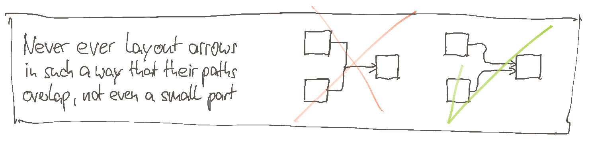

# Visual tips for system diagrams
Martin Leggewie, 2021-02-13

## Abstract

In this article I describe a collection of visual tips for creating so-called system diagrams.
The purpose of such diagrams is to convey information about a system landscape to the audience, and be the basis for discussions.
Therefore, it is a good advice to keep these diagrams as simple as possible.
If you want/need to create such diagrams yourself, then these tips can support you in reaching this "as simple as possible" goal.

## Introduction

Before I start with the actual tips, let me first define what a system diagram is and what it is good for.

### Definition and goal: System diagram

A **system diagram** is a visual representation of a given real-world system landscape, typically located in the IT world.
In such a landscape a collection of systems and contained system components are connected to each other in order to make a specific functionality available to its users.

The **goal of a system diagram** is to explain how the structure of a system landscape looks like, and how the users interact with it.
Once the audience has understood this structure, the system diagram can be the  basis for discussions.

A system diagram could look like this:

Typically, the **visual language of system diagrams** consists of the following elements:

| Element | used to represent |
|---|---|
| stick figure | users |
| box | system, system component, environment |
| cylinder | data storage system |
| cloud | environment which is huge and/or unknown |
| arrow | call dependency, data flow |
| text | name of a visual element |

In addition, certain types of shapes (typically the boxes) can be placed inside other shapes to represent that one element contains or consists of other elements.

### Why should you care about how system diagrams look like?

Maybe you think that it is more important to create system diagrams correctly, compared to how they look like.
To follow this "A over B" catchphrase style used in the <https://agilemanifesto.org> and <https://www.halfarsedagilemanifesto.org>:

"Correct and useful content over simple and easy-to-understand visuals"

I absolutely agree.

Of course, we first need to make sure that our diagrams contain the correct information, specifically created for the intended type of audience.
But then, once we have the correct structure defined, we should also make sure that the audience does not need to suffer too much when trying to understand the information.

I would like to demonstrate what I mean with a concrete example.
Below you see an example system diagram:

I don't know about you, but I think that this diagram is already quite readable, and the audience should be able to understand
* with which system the user interacts,
* which systems store something in the database,
* which systems are somehow connected to which other systems, and
* what are the boundaries of the different elements.

Admittedly, this diagram is not very complicated because it contains only one user, three systems, one database, and in total six connection arrows.
With such a simple example, it should not be so important to put much emphasis on the visual style.

Well, let's see.

Let's have a look on another diagram which contains the exact same information.
But this time the creator applied a different visual style to the diagram elements.

In my point-of-view this diagram is much more difficult to read.
It is difficult to understand what all the elements are, and how they are related to each other.
The reason for this is a suboptimal usage of colors, fonts, shapes, and sizes and arrangement of elements in relation to each other.

Maybe you think that it was me who has created this second diagram in this difficult-to-read way on purpose, just to make a point, and that I exaggerated quite a bit.
The answer is: Yes, and no.

* Yes, I created the diagram intentionally like this, to make my point.
* No, I did not exaggerate.

If you don't believe me, please do an Internet search for the term "system diagram", and check the images your preferred search engine returns.
Some of them will be in a clean style, maybe similar to the first example diagram shown above.
But there also will be quite some images which are visually closer to the second example diagram.

I do think that if we put effort in the creation process to come to simple diagrams which strip unneeded clutter, the audience will thank us because it will be easier for them to get the information.
After all, these diagrams are not meant to be pieces of art.
Instead, their sole purpose is to convey information and to trigger people to talk about the diagram's topic.

## What is in for you?

If you agree with me that the second diagram is somehow suboptimal, and if you also agree that the creator should and could have done better, then we are on the same page.

Over the past years I have experimented a lot with visual tools which can be used to create system diagrams.
From those experiment results I distilled general tips and tricks I now apply when I need to create such diagrams.
These tips help me to create diagrams with a clean and consistent structure.

Now, if you invest your precious time in reading this text, you will find the list of all these tips.
Maybe you can take-away some ideas which support you the next time you have to create such diagrams yourself.

## Mind-map of the things to come

_TODO: Create a proper and readable version of the following mind-map_

## General guidelines

The foundation of all the tips to come are some general rules.
These rules are the **mission statement** for the style of visual representation for system landscapes.
Each of the following subsections explain one such rule.

### Guideline 1: Use simple visual attributes, avoid the "bling-bling"

Only use simple visual attributes like solid fill colors and 2D elements.
Avoid any other visual expression ways like drop shadows, pseudo 3D elements, and color gradients just "because you can".
Any type of visual aspect you use in your diagram should be connected to one type of information.
If you use a visual aspect just because your graphics software offers it, then resist the temptation:
Don't use it if it does not add any information to your diagram.

In the following I would like to show you some visual aspects I normally strongly recommend not to use.

#### Do not use color gradients

Using a color gradient just because it "looks cool" is not very helpful.
It irritates the audience because they think that this gradient has some special meaning which in fact it does not.
And the gradient effect typically breaks down when you apply it to visual elements of different sizes.

**Example:**
The diagram below compares two system diagrams using solid and gradient fill colors for the boxes, respectively.
The gradient from top to bottom starts with yellow and ends with blue.
The fill algorithm of the graphical application I have used to create this diagram calculates all the colors in between in a linear transition.

The visuals of the diagram on the right side introduce some problems:

* The gradient fill makes it harder to read the text. Of course, you could apply a brighter color as blue, but then there would not much be left from the gradient. A gradient from a bright color to another bright color does not create much color transition.

* The gradient fill color looks different when comparing the taller box ("Huge Other System") with the other two.
As the taller box offers more vertical space to be filled, the audience can see more of all the intermediate colors.
In the example, a (quite muddy) green-ish color appears in the vertical middle.
The other two smaller boxes do not show this green-ish color because there is just not enough room available.
All in all this creates a different color appearance for the taller box although all three boxes should get the same color.

* Maybe just a minor thing: At least in my perception the intermediate colors look somewhat polluted, as if there was some dust cover which has not been removed by the cleaning personnel.

#### Do not use 3D elements

As long as you do not plan to create a three-dimensional world in which the third dimension really has some specific meaning, stay away from any 3D perspective.
In my opinion, you will only stumble upon this additional dimension of complexity for no good.

**Example:**
In the example below, the two diagrams on the right side both apply an isometric 3D perspective.

This shows the problems which arise because of not using 2D.

* In the upper right diagram the drawing tool's connection feature is used.
As the tool does not support real 3D, it applies the connectors in a wrong inconsistent way.

* In the lower right diagram I have manually corrected the inconsistencies, but now some arrow heads (visually correctly!) vanish.

Either way, you will only have some extra work to do with no real benefit as the third dimension does not convey any additional information.

#### Do not use drop shadows

Using drop shadows is a bit like using 3D for the diagrams:
It might look "more pleasing" or maybe even "more professional" (some say this is very important if you work in an enterprise environment).
But drop shadows do not provide any additional information; instead, they just add visual clutter to the scenery, and hence we should not use them at all.

**Example:** 
The following example diagram shows directly what the problems with the drop shadows are:

Especially for the connection arrows it can look like as if there is another arrow directly below or next to the main ones.
This can be confusing, and even if not, the audience need some extra effort to realize that there are no additional arrows, and that these drop shadows do not have any meaning whatsoever.

#### Do not use the "sketch" visual style

Some graphical tools seem to "know" that they are typically used in concept phases, and that the created diagrams represent something which is not yet implemented, but still is in draft.
To represent this draft status, these tools provide some "sketch" or "concept" or "draft" or "scribble" mode.
In such a mode, the diagram should look like as if a human being has manually drawn everything by hand.
The problem with such sketchy-looking diagrams is that it is just more difficult for the audience to understand what the diagrams want to say.
Therefore, just don't use these sketch modes.

**Example:** 
The example below shows the difference when comparing the normal style with the sketch style.

While I have to admit that the sketch style looks appealing, it adds visual clutter which is not necessary, and therefore I strongly vote for using the normal style.

### Guideline 2: Define the meaning of all visual elements in a legend

A legend explains the meaning of all visual elements and attributes used in the diagram.
Well, always add a legend to your diagram.
Without this legend, the audience has no other choice than to interpret the meaning of the elements of your visual language.
And if the audience needs to interpret, then this will cause misunderstandings.

Even if you use a well-defined visual language like UML for your diagrams, add a legend to your diagram.
Maybe you know all the elements of - for example - UML deployment diagram style (see <https://en.wikipedia.org/wiki/Deployment_diagram>), but you cannot assume that the audience knows this as well.
Adding a legend becomes even more important if you use your own visual language (like I do all the time).
If you don't define this language, the audience cannot know what a box with rounded corners means and how it is different from the boxes with sharp corners, or what is the difference between yellow and green fill style.

It does not stop with the boxes.
Maybe even more important than the boxes are the connection lines, with or without arrow heads.
Such a connection line expresses that there is some kind of association between the entities it connects to each other.
And if you find arrow heads at the end of a line, then obviously the association has a direction of some kind.

But: What does the connection line and its direction stand for?
What kind of information is transferred via the connection?
Is this connection relevant during design, deploy, or runtime?
Do the arrow heads show the direction in which data flows, or do they show which systems call which other systems?
We cannot know until there is a legend which clearly defines this.

**Example:**
The following system diagram I have already shown in the introduction section, but now it finally also contains a legend (which I should have added to the example in the first place anyway).

You might notice another small change in the diagram compared to the first version shown in the introduction section:
The connection arrow from "User" to "System A" has a "uses" annotation.
I could have put this type of relation "User uses system" also as an additional entry in the legend, next to the "System calls system" annotation.
But as this "User uses system" relation type only exists once in the diagram, I find it easier for the reader if the type of relation (i.e., "uses") appears directly next to the connection arrow.

### Guideline 3: Apply high-contrast coloring style

If you apply "enough" contrast to your diagrams, it becomes easier for the audience to tell all the contained elements apart.

In the visual domain, the term "contrast" defines the difference in either luminosity and/or color when comparing visual elements.
For a given visual element (say, a rectangle) luminosity defines how much light the element emits/reflects whereas color defines the wavelength of the light the element emits or reflects.

To achieve the highest possible **contrast with luminosity**, you need to put a black (= the complete absence of light) element next to a white (= all the light there is, of all wavelengths) element.

To achieve the highest possible **contrast with color**, you need to put elements with their corresponding complementary colors next to each other.

This means in principle:
You should always use white as the fill color when you choose black as the border color (or the other way around).
In whatever way, putting black and white next to each other results in the highest possible contrast at all, and so we should only use this, right?

Well.
The world is not only black and white:

* You might need different fill colors in the same diagram because fill color is one major visual aspect you can use to express different values for the same type of system attribute.
* You typically have white also as the background color.
Now, if all the boxes are white, as well as the background, then again it might become a bit difficult to separate everything, even when there is black as a border color.

**Example:**
The diagram below, left side, shows one way of achieving high contrast:
Use black as the color for borders and arrows, as well as for text in these boxes, and use bright colors to fill the boxes.

On the right side you see the very same system landscape, but this time the brightness of all four different fill colors is significantly decreased while at the same time the color for borders and arrows is increased.

This results in a lower contrast and thus bad readability because

* the black text is now closer to the luminosity value of the fill colors, and 
* the grey color of the borders and arrows is now closer to the white background color.

## Canvas

TODO

### Set-up a square-like grid

TODO. Example: 10x10, unit is in fact meaningless if you use a vector based graphics program.

### Enable snap to grid

TODO.

### Use infinite space, disable any page size

TODO

## Text

TODO

### Use sans-serif font face

TODO

### Select font size in relation to canvas grid size.

TODO

### Select font style according to the type of texts

TODO

#### Use bold font style for all important names

TODO

#### Use normal font style for all companion text

TODO

#### Do not use italics font style

TODO

## Lines

TODO. At the moment I only have one general rule for lines. Let's see then if it makes sense to have a separate chapter when there is only one subsection.

### Choose line thickness

TODO

## Layout

TODO. At the moment I only have one general rule for layout. Let's see then if it makes sense to have a separate chapter when there is only one subsection.

### Apply a "hidden grid" when positioning shapes

TODO

## Shapes

TODO

### Use same size for all boxes representing the same element style

TODO

### Use size for inner-most elements to be even multiples of canvas grid size

TODO

### Use well-defined height-width ratio for inner-most elements

TODO. 1:2, 1:3, 1:4, 2:3, 3:4, 3:5

### Watch out when using rounded corners for boxes

TODO

## Arrows

TODO

### Choose arrow heads to be big enough compared to diagram size

TODO

### Define exactly what the arrow directions mean

TODO. Call dependency? Data flow direction?

### Avoid arrow heads in both directions.

TODO. To me having arrow heads in both directions have a strong smell of being lazy or not precise enough.

### Attach a bigger dot at the arrow start

TODO. This is especially useful if you cannot avoid that arrows cross each other because then the audience can make a difference between a real connection or just the restriction of the 2D projection.

## Color

TODO

### Choose color so that audience's attention will be guided to the most important diagram elements first

TODO

### Color styles

TODO

#### Black border, normal fill

TODO

#### Black border, inverted fill

TODO

#### No border, inverted fill

TODO

## Layout of shapes and their connection arrows

TODO

### Flow either top-to-down or left-to-right

TODO

### Try to avoid crossing connection arrows

TODO

### Never ever allow overlapping connection arrows

TODO

### Don't start or end different connection arrows at the same point

TODO

### Connection routing path styles

TODO

### Choose gap between boxes

TODO

## Closing words

TODO.
* Thank the audience for spending their time.
* Hope that it has been useful for the audience.
* Invite audience to provide feedback.
* Add contact information.
* Recommend my favorite graphical application for creating system diagrams (which is draw.io). Make clear that I am not related to draw.io in any way. This is not advertisement.
