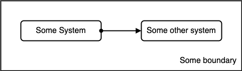
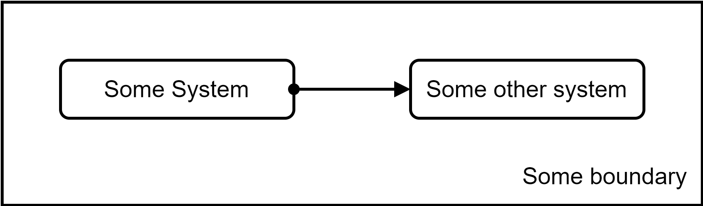

# Some information about the created diagrams in this folder.

I have used the standalone version of draw.io installed on my Windows and MacOS to create the diagrams in this folder.
Besides it being superb for creating such diagrams anyways, draw.io has two neat features which stayed under my radar for quite some time.
Just recently I rather coincidally discovered them, and I really wished I would have discovered them earlier.
Since then I use these features, and if you would like to apply some changes or add new diagrams next to the existing ones, I can only urgently ask you to use these features as well.

Both features relate to the fact that you normally store diagrams in draw.io's own proprietary XML format.
If you want to include such a diagram in other documents like (perish the thought!) a PowerPoint file, you always need to export the diagrams into some standard bitmap file format.
(Of course you always use PNG as that bitmap format. Of course you will never use JPG for such schematic images like diagrams, do you? Of course you know that JPG uses a lossy compression algorithm which causes that any schematic image parts like text or straight artificial lines gets really ugly compression artifacts in the image.)

## Feature 1: Use "Editable Bitmap Image" PNG as file format for the diagram's source file

Instead of using the XML format, please directly use PNG as the only file format.
PNG allows storing meta information inside the file, next to the actual bitmap, and draw.io is able to store its proprietary XML vector format inside the PNG.
That means you never ever need to export to a PNG file, and therefore you can also never forget to export to PNG after having changed the diagram.
You will only have one file at all, namely the PNG file.

Any other application like for example a web browser which does not know about draw.io will ignore the meta information and just show the image.
But if you open the PNG in draw.io later, all the vector information is still there, and you can continue working on it.

## Feature 2: Increase internal zoom factor of the diagram from 100% to 400%

Whenever you create a vector-based image but in the end need it as a bitmap, your application needs to rasterize the vector information of the image into a bitmap mainly consisting of pixels and their color information.
To do this rasterization, the application needs to decide on how fine- or coarse-grained the used raster should be.
The finer the raster, the more pixels the resulting bitmap will get.
Of course, the more pixels there are in the bitmap, the more memory the bitmap needs, both in RAM and in the resulting bitmap file.

Now, draw.io also needs to decide how fine or coarse the raster should be.
When I create a diagram in draw.io, I choose the sizes of boxes, texts and so in such a way that still quite some information is visible when using a 100% zoom factor for viewing the diagram.
For example, a typical box has a size of 160x40 pt.

But when you then look at the PNG file, you'll see that the rasterized bitmap is small and coarse, and therefore it can be difficult to read the diagram's information.

Below there is an example diagram with standard raster.
Depending on the rendering engine your application uses to display the diagram on the screen, straight lines and the text are either jagged (for example, when using the MacOS finder preview), or blurred (for example, when using Safari).

To avoid blurred or jagged diagram elements, you need to tell draw.io to use a finer raster.
To do this, **open the file properties dialog** and **change the zoom value from 100% to 400%**.
After that change, the overall resolution of the raster will be quadrupled.
There will be 4 times as many pixels in both x and y dimension, resulting in a bitmap which has 16 times more pixels compared to the standard raster.

Since the objects in the diagram still consume the same space relative to each other, having a 4 times higher resolution significantly reduces the "jaggedness".
When you look at the bitmap in a typical zoom setting, you won't see any pixels.
Hence, the readability will be much better compared to the standard raster setting.

To visualize this, please look at the diagram below. It shows the very same information as the first image, but now with a 4 times bigger raster factor.

At a normal zoom level, I guess you cannot see any pixels anymore.
To do a fair comparison, zoom in or out in such a way that both example diagrams appear in the same size before you compare them with each other.
Then you will see that the second diagram contains way more visual detail and therefore no blur or jaggedness, whereas the first still is blurred or jagged.

Maybe you think that I am too picky about such details :-)
But caring about such details is the whole point of this article.
Actually, this is the overall statement I want to make:
All these details applied together can make it significantly easier for the reader to get the messages you want to convey, even when most of these details might only be "just tiny things", when being looked at in an isolated way.